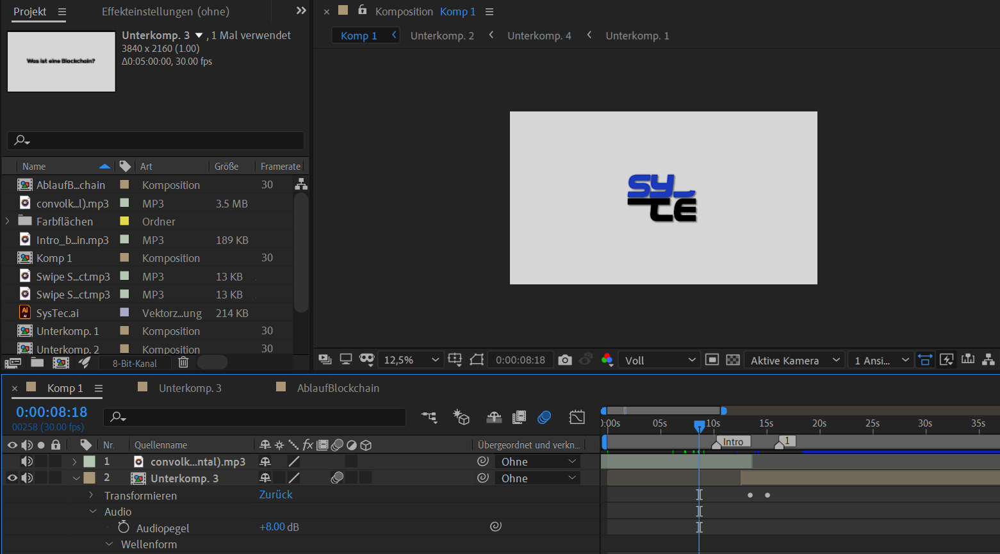

# M431_CC
## Einleitung
In diesem Projekt wollen wir mehr über die Projektführung erfahren, damit wir später ohne Probleme selbst Projekte durchführen können. Dies wird uns sehr hilfreich sein bei unserer IPA, die in 3 Jahren ansteht. Da wir bereits Erfahrungen in unserer Firma gemacht haben, haben wir hohe Erwartungen an uns und wollen das Projekt mit wenig Hilfe durchführen. 
Auch soll hierbei der Fokus nicht allzu gross auf dem Endprodukt liegen, sondern eher auf der Art, wie wir das Projekt bestreiten und die Erfahrungen die wir sammeln, während dieser Zeit. 
## Informieren
Fürs Informieren haben wir zuerst einmal mit einem Mindmap begonnen dieses haben wir dann mit einem Brainstorming erweitert. Schlussendlich waren wir mit den Ideen aber noch nicht ganz Einig und haben mithilfe von Herr Calisto einen Entschluss getroffen ein Erklärungsvideo über Blockchain zu machen. Denn Blockchain ist mit der neunen Technik immer presenter geworden und ist ein sehr interessantes Thema, dass sehr viele Möglichkeiten bietet. Dies werden wir grösstenteils durch das Internet erlernen, wie YouTube und Internetseiten. 

Links:
https://www.ibm.com/topics/what-is-blockchain 
https://www.euromoney.com/learning/blockchain-explained/what-is-blockchain 
https://www.coinbase.com/de/learn/crypto-basics/what-is-a-blockchain 

https://www.youtube.com/watch?v=baF9b5Lkiio = Orientierung des Erklärungsvideo 

## Planen
### Zeitplan
Der Zeitplan haben wir mit Hilfe des Gantt-Diagramm erstellt und durch das Wissen bereits vergangener Projekte. Dabei haben wir nach IPERKA struckturiert und darunter alle Teilziele aufgeführt. Als wir alle Teilziele hatten, haben wir ihnen Tage zugewiessen, an denen wir diese Teilziele erarbeiten werden.
### Meetings / Meilensteine
-23.05.2022: Projektbeginn 
-06.06.2022: Beginn der Realisierung 
-20.06.2022: Alle Informationen bereit 
-27.06.2022: Video fertig 
-04.07.2022: Letzte Besprechung / Anpassungen 
-11.07.2022: Projektende / Präsentation 
### Ressourcenplanung
-Adobe After Effects (immer vorhanden) 
-Links (immer vorhanden) 
-YouTube Vorlage (immer vorhanden) 
-Laptops (immer vorhanden) 
-PowerPoint (immer vorhanden, für Präsentation) 
## Entscheiden
Wir haben uns für das Erklärungsvideo entschieden, weil Blockchain ein grosses Thema ist und durch die grossen Cryptowährungen ein wichtiger Bestandteil der heutigen Technik wurde. Da Blockchain noch viele Leute nicht richtig verstehen und  es bestimmt auch viele Leute in der IT interessiert haben wir uns für ein Erklärungsvideo entschieden. Das Thema ist ausserdem sehr interessant und wir beide haben den Willen mehr darüber zu lernen. Auch wollen wir mit Hilfe von Adobe After Effects das Video animieren, denn in diesem Thema hat Colin schon 3 Jahre Erfahrung und wir müssen uns nicht mehr allzu fest damit befassen. Das Erklärungsvideo orientiert sich nach den Videos von Simpleclub, da viele junge Persönlichkeiten diesen Stil von Videos sehr attraktiv finden und viel davon lernen. 
## Realisieren
Am Anfang des Realisierens haben wir ein Drehbuch erstellt. Bei diesem ging es uns darum alle Texte, die wir aufnehmen aufzuschreiben und allgemein den Ablauf zu erarbeiten. Danach haben wir zu diesem Drehbuch die Aufnahmen gemacht. Dies haben wir Zuhause gemacht, da wir Zuhause gute Mikrofone haben und wir sowieso noch Zeit nachholen musste, da wir am 20.06.2022 schon früher nach hause durften. Danach war nur noch das Animieren an der Reihe, das zum grössten Teil Colin übernommen hat. 
 
Die Realisierung des Erklärungsvideos ging zuerst einmal los mit einer Introduction Animation unserer Firma SysTec, welche mit dem neusten Logo ausgestattet ist. Dieses Intro wurde aber eher simple gehalten, da wir nicht zu viel Zeit und Fokus auf diese Intro Animationen aufwenden wollten. Durch das Drehbuch konnte das Video auch gut strukturiert aufgebaut werden mit verschiedenen "Slides" zu den einzelnen Teilthemen. Die Sprachaufnahmen wurden auch bereits so zugeschnitten, dass Sie passen und nun fehlt nur noch die genaue Grafik und dessen Animation. 
 

## Kontrollieren
Bei dem Kontrollieren haben wir zuallererst Beide nochmals das Video angeschaut und mit der Checkliste abgeglichen, dabei fiel uns auf, dass wir keine Nachteile und auch keine richtigen Vorteile im Video erwähnt haben. Der Grund dafür ist, dass die Blockchain nicht wirklich Nachteile hat, bis auf das alle Daten für immer in der Blockchain gespeichert sind. Vorteile haben wir zwar erwähnt, doch nicht sehr speziefisch. Wir sind eher allgemein auf die Erklärung der Blockchain eingegangen und wenig auf die Vorteile. Unser anderes Ziel, dass wir noch nicht erreicht haben, ist das Kahoot in der Klasse, bei dem mindestens 5 Personen 7/8 Fragen richtig beantworten, um zu überprüfen, ob unser Video gut ist. Dies können wir erst auswerten, wenn wir die Präsentation abgehalten haben. Die restlichen Ziele haben wir alle erreicht oder sogar übertroffen, wie zum Beispiel, dass unser Video 5 Minuten lang wird. Dabei konnten wir viel mehr erzählen und daher haben wir ein Video, dass 8:30 Minuten lang ist. Auch, dass das Video am letzten Tag fertig ist, haben wir vorgezogen und sind bereits eine Woche früher fertig.
 

## Auswerten

=============== 
Project by Colin & Cyril 
