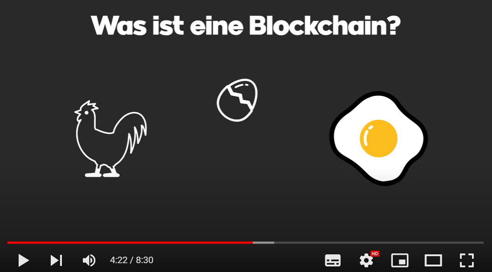

# M431 Projektdokumentation
## Was ist eine Blockchain - Erklärungsvideo

---

## Inhaltsverzeichnis

- [Projektdokumentation](Projektdokumentation.md)

- [Projektauftrag](Projektauftrag.pdf)

- [Gantt-Diagramm](Gantt.xlsx)

- [Nutzwertanalyse](Nutzwertanalyse.xlsx)

- [Drehbuch](Drehbuch.docx)

- [Checkliste](Checkliste.pdf)

## Erstellt von 
 
Cyril Böhler & Colin Schrepfer